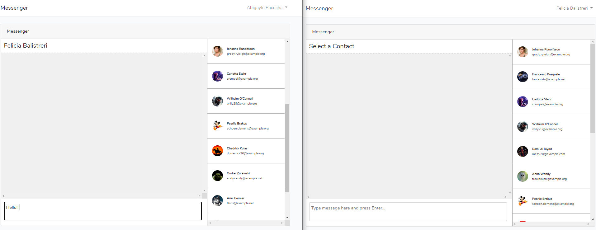
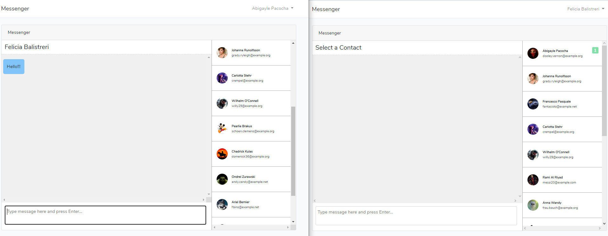

Messenger realtime application with Laravel and Vue.js

<h3>visit https://pusher.com and create a free app. then copy the keys into your .env file</h3>

PUSHER_APP_ID=your_pusher_app_id

PUSHER_APP_KEY=your_pusher_app_key

PUSHER_APP_SECRET=your_pusher_app_secret

PUSHER_APP_CLUSTER=your_pusher_cluster

<h3>change the BROADCAST_DRIVER in your .env to pusher</h3>
BROADCAST_DRIVER=pusher
